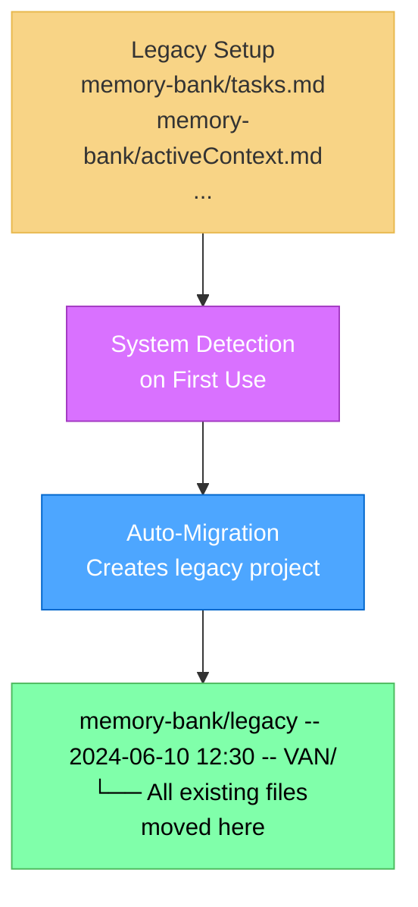

# Multi-Project Migration Guide

This guide helps you migrate from single-project Memory Bank setups to the new multi-project architecture introduced in v0.8-beta.

## Overview

Memory Bank v0.8 introduces **Multi-Project Support** that allows you to manage multiple isolated project contexts within a single repository. This guide covers both **automatic migration** (which happens seamlessly) and **manual project splitting** (for users who want to organize existing work into separate projects).

## Automatic Migration (No Action Required)

When you upgrade to v0.8 and start using Memory Bank, the system automatically handles legacy projects:



**What happens automatically:**
- System detects legacy Memory Bank files in `memory-bank/` root
- Creates a new project folder: `legacy -- <current-timestamp> -- van/`
- Moves all existing files to the new project folder
- Your work continues seamlessly with multi-project support enabled

## Manual Project Splitting (Optional)

If you want to organize your existing work into multiple focused projects, you can manually split your legacy project.

### When to Consider Manual Splitting

Consider manual splitting if your current Memory Bank contains:
- Multiple distinct features or bug fixes
- Different types of work (features, documentation, infrastructure)
- Work that could benefit from separate contexts
- Historical work you want to organize by themes

### Step-by-Step Manual Splitting Process

#### Step 1: Backup Your Current Setup

```bash
# Create a backup of your current memory-bank folder
cp -r memory-bank/ memory-bank-backup/
```

#### Step 2: Analyze Your Current Content

Review your existing Memory Bank files to identify logical project boundaries:

```bash
# List all files in your current Memory Bank
find memory-bank/ -type f -name "*.md" | head -20
```

Look for:
- **tasks.md**: Multiple distinct tasks or features
- **creative/**: Design decisions for different components
- **reflection/**: Reviews of different work areas
- **archive/**: Historical work that can be grouped

#### Step 3: Create New Project Folders

Create separate project folders for each logical group:

```bash
# Create new project folders (replace names with your actual projects)
mkdir -p "memory-bank/user-authentication -- 2024-06-10 12:30 -- VAN"
mkdir -p "memory-bank/api-refactor -- 2024-06-10 12:30 -- VAN"
mkdir -p "memory-bank/bug-fixes -- 2024-06-10 12:30 -- VAN"
```

#### Step 4: Distribute Content

**Option A: Split by Task/Feature**
```bash
# Example: Moving authentication-related content
mkdir -p "memory-bank/user-authentication -- 2024-06-10 12:30 -- VAN/creative"
mkdir -p "memory-bank/user-authentication -- 2024-06-10 12:30 -- VAN/reflection"
mkdir -p "memory-bank/user-authentication -- 2024-06-10 12:30 -- VAN/archive"

# Move relevant files
cp memory-bank/creative/creative-auth-system.md "memory-bank/user-authentication -- 2024-06-10 12:30 -- VAN/creative/"
cp memory-bank/reflection/reflection-auth-implementation.md "memory-bank/user-authentication -- 2024-06-10 12:30 -- VAN/reflection/"
```

**Option B: Split by Work Type**
```bash
# Example: Separate features from bug fixes
mkdir -p "memory-bank/feature-development -- 2024-06-10 12:30 -- VAN"
mkdir -p "memory-bank/maintenance-fixes -- 2024-06-10 12:30 -- VAN"
```

#### Step 5: Create Project-Specific Core Files

Each project needs its own core files:

```bash
# For each new project, create core files
cd "memory-bank/user-authentication -- 2024-06-10 12:30 -- VAN"

# Create tasks.md with project-specific content
cat > tasks.md << 'EOF'
# User Authentication System

## Current Focus
Implementing secure user authentication with JWT tokens and refresh token rotation.

## Active Tasks
- [ ] JWT token generation and validation
- [ ] Refresh token rotation mechanism
- [ ] Password reset functionality
- [ ] Two-factor authentication setup

## Implementation Status
- [x] User registration endpoint
- [x] Login endpoint with JWT
- [ ] Token refresh endpoint
- [ ] Password reset flow
EOF

# Create activeContext.md
cat > activeContext.md << 'EOF'
# Active Context: User Authentication

## Current Phase
IMPLEMENT - Building JWT refresh token mechanism

## Key Focus Areas
- Token security best practices
- Refresh token rotation
- Session management
- Error handling for authentication failures

## Next Steps
1. Implement refresh token rotation
2. Add comprehensive error handling
3. Create authentication middleware
4. Write integration tests
EOF

# Create other core files as needed
touch progress.md
touch projectbrief.md
touch productContext.md
touch systemPatterns.md
touch techContext.md
```

#### Step 6: Update File References

Update any cross-references between files to reflect the new project structure:

```bash
# Search for references to old file paths
grep -r "memory-bank/" "memory-bank/user-authentication -- 2024-06-10 12:30 -- VAN/" || echo "No references found"

# Update references if found (manual process)
```

#### Step 7: Verify Project Structure

Each project should have this structure:

```
memory-bank/
├── user-authentication -- 2024-06-10 12:30 -- VAN/
│   ├── tasks.md
│   ├── activeContext.md
│   ├── progress.md
│   ├── projectbrief.md (optional)
│   ├── creative/
│   ├── reflection/
│   └── archive/
├── api-refactor -- 2024-06-10 12:30 -- VAN/
│   ├── tasks.md
│   ├── activeContext.md
│   └── ...
└── bug-fixes -- 2024-06-10 12:30 -- VAN/
    ├── tasks.md
    ├── activeContext.md
    └── ...
```

### Project Naming Best Practices

**Good Project Names:**
- `user-authentication`
- `api-refactor`
- `bug-fixes`
- `documentation-update`
- `performance-optimization`

**Avoid:**
- Special characters except hyphens, underscores, spaces
- Very long names (keep under 30 characters)
- Names that conflict with existing folders

### Testing Your Migration

1. **Test Project Discovery:**
   ```bash
   # Switch to VAN mode in Cursor and run:
   LIST PROJECTS
   ```

2. **Test Project Switching:**
   ```bash
   SWITCH PROJECT user-authentication
   CURRENT PROJECT
   ```

3. **Verify Isolation:**
   - Switch between projects
   - Confirm that tasks.md content changes appropriately
   - Verify that file operations stay within project boundaries

## Migration Strategies

### Strategy 1: Gradual Migration
- Keep your legacy project as-is
- Create new projects for new work
- Gradually move completed work to themed projects

### Strategy 2: Complete Reorganization
- Split all existing work into logical projects
- Archive historical work in separate projects
- Start fresh with clean project contexts

### Strategy 3: Hybrid Approach
- Keep recent active work in the legacy project
- Create new projects for new initiatives
- Archive old completed work in historical projects

## Troubleshooting Migration Issues

### Common Issues

1. **File Path References**
   - **Problem**: Old file references point to wrong locations
   - **Solution**: Update references manually or use find/replace

2. **Project Names with Special Characters**
   - **Problem**: Folder names with invalid characters
   - **Solution**: Use only alphanumeric, hyphens, underscores, spaces

3. **Timestamp Conflicts**
   - **Problem**: Multiple projects created with same timestamp
   - **Solution**: Manually adjust timestamps in folder names

4. **Missing Core Files**
   - **Problem**: Project doesn't have required core files
   - **Solution**: Create minimal core files (tasks.md, activeContext.md)

### Getting Help

If you encounter issues during migration:

1. **Check the logs**: Look for error messages during project switching
2. **Verify folder structure**: Ensure projects follow naming conventions
3. **Test incrementally**: Migrate one project at a time
4. **Keep backups**: Always maintain backup of original structure

## Benefits of Multi-Project Architecture

After migration, you'll benefit from:

- **Complete Project Isolation**: Each project has its own context and files
- **Focused Work Sessions**: Switch between projects without context contamination
- **Better Organization**: Logical grouping of related work
- **Parallel Development**: Work on multiple projects simultaneously
- **Historical Preservation**: Maintain separate archives for different work areas

## Conclusion

The multi-project architecture provides powerful organization capabilities while maintaining full backward compatibility. Choose the migration approach that best fits your workflow - whether that's automatic migration, manual splitting, or a hybrid approach.

Remember that migration is optional - the system works perfectly with automatically migrated legacy projects if you prefer to maintain your current organization structure. 