# Multi-Project Memory Bank

## Background

This project began as a fork of an open-source Memory Bank project.  
It has since diverged and is now maintained independently, with a primary focus on robust multi-project support and workflow refinements.  
All future development and issue tracking will happen **here**.

> **Maintainer Note**: I maintain this project in my spare time and welcome constructive feedback. Feel free to open an issue or pull request, or adapt the code to fit your own workflow.

A token-optimized, hierarchical task management system that integrates with Cursor custom modes for efficient development workflows.

```mermaid
graph TD
    Main["Multi-Project Memory Bank"] --> MultiProject["Multi-Project Support"]
    Main --> Modes["Custom Modes"]
    Main --> Rules["Hierarchical Rule Loading"]
    Main --> Visual["Visual Process Maps"]
    Main --> Token["Token Optimization"]
    
    MultiProject --> Projects["🗂️ Project Isolation"]
    MultiProject --> Commands["📋 LIST • SWITCH • CURRENT"]
    MultiProject --> Legacy["🔄 Legacy Compatibility"]
    
    Modes --> VAN["VAN: Initialization"]
    Modes --> PLAN["PLAN: Task Planning"]
    Modes --> CREATIVE["CREATIVE: Design"]
    Modes --> IMPLEMENT["IMPLEMENT: Building"]
    Modes --> REFLECT["REFLECT: Review"]
    Modes --> ARCHIVE["ARCHIVE: Documentation"]
    
    style Main fill:#4da6ff,stroke:#0066cc,color:white
    style MultiProject fill:#ff6b6b,stroke:#e74c3c,color:white
    style Projects fill:#ffa07a,stroke:#ff6347,color:black
    style Commands fill:#ffa07a,stroke:#ff6347,color:black
    style Legacy fill:#ffa07a,stroke:#ff6347,color:black
    style Modes fill:#f8d486,stroke:#e8b84d,color:black
    style Rules fill:#80ffaa,stroke:#4dbb5f,color:black
    style Visual fill:#d9b3ff,stroke:#b366ff,color:black
    style Token fill:#ff9980,stroke:#ff5533,color:black
```



## About Memory Bank

Memory Bank is a personal project that provides a structured approach to development using specialized modes for different phases of the development process. It uses a hierarchical rule loading architecture that loads only the rules needed for each phase, optimizing token usage and providing tailored guidance.

### Token-Optimized Architecture

- **Hierarchical Rule Loading**: Only loads essential rules initially with specialized lazy-loading
- **Progressive Documentation**: Implements concise templates that scale with task complexity
- **Optimized Mode Transitions**: Preserves critical context efficiently between modes
- **Level-Specific Workflows**: Adapts documentation requirements to task complexity

See the [Memory Bank Optimizations](MEMORY_BANK_OPTIMIZATIONS.md) document for detailed information about all optimization approaches.

### Beyond Basic Custom Modes

While Cursor's documentation describes custom modes as primarily standalone configurations with basic prompts and tool selections, Memory Bank significantly extends this concept:

- **Graph-Based Mode Integration**: Modes are interconnected nodes in a development workflow rather than isolated tools
- **Workflow Progression**: Modes are designed to transition from one to another in a logical sequence (VAN → PLAN → CREATIVE → IMPLEMENT → REFLECT → ARCHIVE)
- **Shared Memory**: Persistent state maintained across mode transitions via Memory Bank files
- **Adaptive Behavior**: Each mode adjusts its recommendations based on project complexity
- **Built-in QA Functions**: QA capabilities can be called from any mode for technical validation

This approach transforms custom modes from simple AI personalities into components of a coordinated development system with specialized phases working together.

### CREATIVE Mode and Claude's "Think" Tool

The CREATIVE mode in Memory Bank is conceptually based on Anthropic's Claude "Think" tool methodology, as described in their [engineering blog](https://www.anthropic.com/engineering/claude-think-tool). The upstream project implemented an optimized version with:

- Progressive documentation with tabular option comparison
- "Detail-on-demand" approach that preserves token efficiency
- Structured templates that scale with complexity level
- Efficient context preservation for implementation phases

For a detailed explanation of how Memory Bank implements these principles, see the [CREATIVE Mode and Claude's "Think" Tool](creative_mode_think_tool.md) document.

## Key Features

- **Multi-Project Support**: Isolated project contexts within a single repository
- **Hierarchical Rule Loading**: Load only the essential rules with specialized lazy-loading
- **Progressive Documentation**: Concise templates that scale with task complexity
- **Unified Context Transfer**: Efficient context preservation between modes
- **Mode-Specific Visual Maps**: Clear visual representations for each development phase
- **Level-Specific Workflows**: Adapted processes based on complexity (Levels 1-4)
- **Platform-Aware Commands**: Automatically adapts commands to your operating system
- **Legacy Compatibility**: Seamless migration from single-project setups

## Installation Instructions

### Prerequisites

- **Cursor Editor**: Version 0.48 or higher is required.
- **Custom Modes**: Feature must be enabled in Cursor (Settings → Features → Chat → Custom modes).


- **AI Model**: Claude 4 Sonnet or Claude 4 Opus is recommended for best results, especially for CREATIVE mode's "Think" tool methodology.

### Step 1: Get the Files

Simply clone this repository into your project directory:

```
git clone https://github.com/jedita/cursor-memory-bank.git
```

#### Alternative (Manual)

After extracting it from the ZIP file, follow the steps below.

- Copy the `.cursor` and `custom_modes` folders to the project directory

Note: other documents are not necessary for memory bank operation, they are explanatory documents. You can copy them to a folder like `memory_bank_documents`.

### Step 2: Setting Up Custom Modes in Cursor

**This is the most critical and challenging part of the setup.** You'll need to manually create six custom modes in Cursor and copy the instruction content from the provided files:

#### How to Add a Custom Mode in Cursor

1. Open Cursor and click on the mode selector in the chat panel
2. Select "Add custom mode"


3. In the configuration screen:
   - Enter the mode name (you can include emoji icons like 🔍, 📋, 🎨, ⚒️ by copy-pasting them at the beginning of the name)
   - Select an icon from Cursor's limited predefined options
   - Add a shortcut (optional)
   - Check the required tools
   - Click on **Advanced options**
   - In the empty text box that appears at the bottom, paste the custom instruction content from the corresponding file

#### Mode Configuration

For each mode, configure as follows (If MCPs are showing, you can keep them on, they probably won't work):

1. **VAN MODE** (Initialization)
   - **Name**: 🔍 VAN
   - **Tools**: Enable "Codebase Search", "Read File", "Terminal", "List Directory"
   - **Advanced options**: Paste from `custom_modes/van_instructions.md`


 

2. **PLAN MODE** (Task Planning)
   - **Name**: 📋 PLAN
   - **Tools**: Enable "Codebase Search", "Read File", "Terminal", "List Directory"
   - **Advanced options**: Paste from `custom_modes/plan_instructions.md`

 

3. **CREATIVE MODE** (Design Decisions)
   - **Name**: 🎨 CREATIVE
   - **Tools**: Enable "Codebase Search", "Read File", "Terminal", "List Directory", "Edit File"
   - **Advanced options**: Paste from `custom_modes/creative_instructions.md`

 

4. **IMPLEMENT MODE** (Code Implementation)
   - **Name**: ⚒️ IMPLEMENT
   - **Tools**: Enable all tools
   - **Advanced options**: Paste from `custom_modes/implement_instructions.md`

 

5. **REFLECT & ARHIVE MODE** (Review)
   - **Name**: 🔍 REFLECT or ARCHIVE
   - **Tools**: Enable "Codebase Search", "Read File", "Terminal", "List Directory"
   - **Advanced options**: Paste from `custom_modes/reflect_archive_instructions.md`

 
   

> **Note**: REFLECT and ARCHIVE instructions are combined in a single file and mode to optimize for Cursor's character and custom mode limits  while maintaining functionality. Thanks to GitHub user @joshmac007 for implementing this optimization.

For additional help on setting up custom modes in Cursor, refer to the [official Cursor documentation on custom modes](https://docs.cursor.com/chat/custom-modes).

### QA Functionality

QA is not a separate custom mode but rather a set of validation functions that can be called from any mode. You can invoke QA capabilities by typing "QA" in any mode when you need to perform technical validation. This approach provides flexibility to conduct verification at any point in the development process.

## Basic Usage

1. **Start with VAN Mode**:
   - Switch to VAN mode in Cursor
   - Type "VAN" to initiate the initialization process
   - VAN will analyze your project structure and determine complexity
   - **Multi-Project**: VAN will discover existing projects or prompt for new project creation

2. **Project Management**:
   - **LIST PROJECTS**: See all available projects with their stages
   - **SWITCH PROJECT <name>**: Change to different project context
   - **CURRENT PROJECT**: Display the active project
   - **NEW PROJECT <name>**: Create new isolated project

3. **Follow the Workflow Based on Complexity**:
   - **Level 1 tasks**: May proceed directly to IMPLEMENT after VAN
   - **Level 2 tasks**: Simplified workflow (VAN → PLAN → IMPLEMENT → REFLECT)
   - **Level 3-4 tasks**: Full workflow (VAN → PLAN → CREATIVE → IMPLEMENT → REFLECT → ARCHIVE)
   - **At any point**: Type "QA" to perform technical validation

      

4. **Mode-Specific Commands**:
   ```
   VAN - Initialize project and determine complexity
   PLAN - Create detailed implementation plan
   CREATIVE - Explore design options for complex components
   IMPLEMENT - Systematically build planned components
   REFLECT - Review and document lessons learned
   ARCHIVE - Create comprehensive documentation
   QA - Validate technical implementation (can be called from any mode)
   ```

5. **Multi-Project Workflow Example**:
   ```
   VAN → LIST PROJECTS → SWITCH PROJECT my-feature → PLAN → CREATIVE → IMPLEMENT
   ```

6. **Starting to work with your project**:
   
After successfully installing Memory Bank...

## Multi-Project Architecture

Multi-Project Memory Bank introduces **Multi-Project Support**, enabling isolated project contexts within a single repository. Each project maintains its own complete set of Memory Bank files in a dedicated subfolder.

### Project Structure

```mermaid
graph TD
    Repo["Repository Root"] --> MB["memory-bank/"]
    MB --> P1["my-feature -- 2024-06-10 12:30 -- IMPLEMENT/"]
    MB --> P2["bug-fix -- 2024-06-09 15:45 -- REFLECT/"]
    MB --> P3["new-api -- 2024-06-08 09:20 -- CREATIVE/"]
    
    P1 --> F1["📄 tasks.md<br>📄 activeContext.md<br>📄 progress.md<br>📁 creative/<br>📁 reflection/<br>📁 archive/"]
    P2 --> F2["📄 tasks.md<br>📄 activeContext.md<br>📄 progress.md<br>📁 creative/<br>📁 reflection/<br>📁 archive/"]
    P3 --> F3["📄 tasks.md<br>📄 activeContext.md<br>📄 progress.md<br>📁 creative/<br>📁 reflection/<br>📁 archive/"]
    
    style Repo fill:#4da6ff,stroke:#0066cc,color:white
    style MB fill:#ff6b6b,stroke:#e74c3c,color:white
    style P1 fill:#ffa07a,stroke:#ff6347,color:black
    style P2 fill:#ffa07a,stroke:#ff6347,color:black
    style P3 fill:#ffa07a,stroke:#ff6347,color:black
    style F1 fill:#e6f3ff,stroke:#b3d9ff
    style F2 fill:#e6f3ff,stroke:#b3d9ff
    style F3 fill:#e6f3ff,stroke:#b3d9ff
```



### Project Management Commands

```mermaid
graph LR
    Commands["Project Commands"] --> List["📋 LIST PROJECTS<br>Show all projects with stages"]
    Commands --> Switch["🔄 SWITCH PROJECT<br>Change active project context"]
    Commands --> Current["📍 CURRENT PROJECT<br>Display active project"]
    Commands --> New["🆕 NEW PROJECT<br>Create new project folder"]
    
    style Commands fill:#4da6ff,stroke:#0066cc,color:white
    style List fill:#80ffaa,stroke:#4dbb5f,color:black
    style Switch fill:#ffa64d,stroke:#cc7a30,color:black
    style Current fill:#d9b3ff,stroke:#b366ff,color:black
    style New fill:#ff8080,stroke:#ff5555,color:black
```



### Project Folder Naming Convention

Projects follow the pattern: `<project-name> -- <timestamp> -- <stage>`

- **Project Name**: Alphanumeric, spaces, underscores, hyphens allowed
- **ISO Timestamp**: YYYY-MM-DDTHH-MM-SS format, auto-refreshed on transitions
- **Stage**: van | plan | creative | implement | reflect (auto-updated on mode transitions)

**Examples**:
- `user-authentication -- 2024-06-10 12:30 -- VAN`
- `api refactor -- 2024-06-09 15:45 -- IMPLEMENT`
- `bug_fix_123 -- 2024-06-08 09:20 -- REFLECT`

## Core Files and Their Purposes


- **tasks.md**: Central source of truth for task tracking (project-scoped)
- **activeContext.md**: Maintains focus of current development phase
- **progress.md**: Tracks implementation status
- **creative/**: Design decision documents generated during CREATIVE mode
- **reflection/**: Review documents created during REFLECT mode
- **archive/**: Comprehensive task documentation for completed work

## Troubleshooting

### Common Issues

1. **Mode not responding correctly**:
   - Verify custom instructions were copied completely (this is the most common issue)
   - Ensure the correct tools are enabled for each mode
   - Check that you've switched to the correct mode before issuing commands
   - Make sure you pasted the instructions in the "Advanced options" text box

2. **Rules not loading**:
   - Make sure the `.cursor/rules/isolation_rules/` directory is in the correct location
   - Verify file permissions allow reading the rule files

3. **Command execution issues**:
   - Ensure you're running commands from the correct directory
   - Verify platform-specific commands are being used correctly

## Resources

- [Cursor Custom Modes Documentation](https://docs.cursor.com/chat/custom-modes)
- [CREATIVE Mode and Claude's "Think" Tool](creative_mode_think_tool.md)
- Mode-specific instruction files in the `custom_modes/` directory
- [Original Memory Bank project (upstream inspiration)](https://github.com/vanzan01/cursor-memory-bank)
